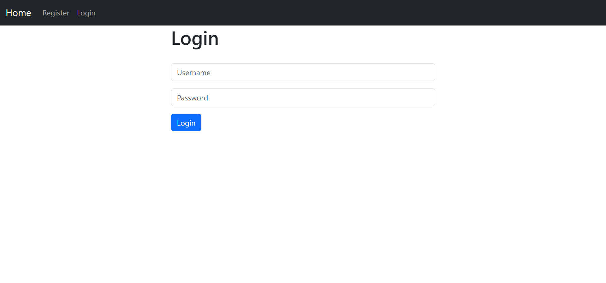
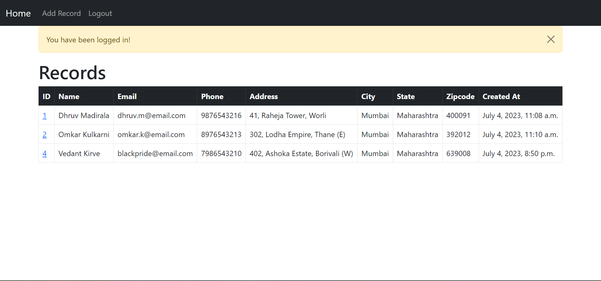
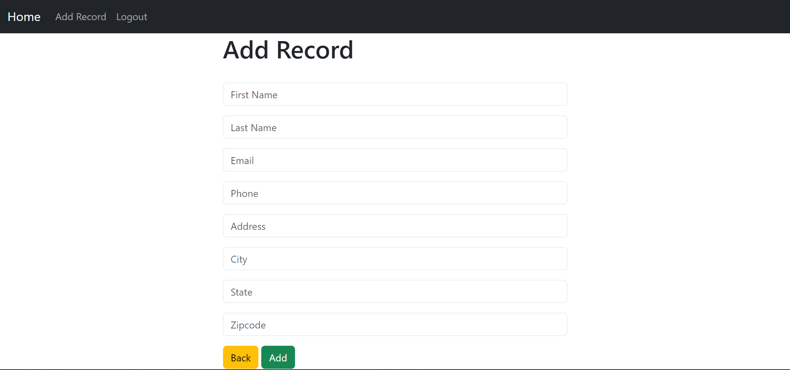
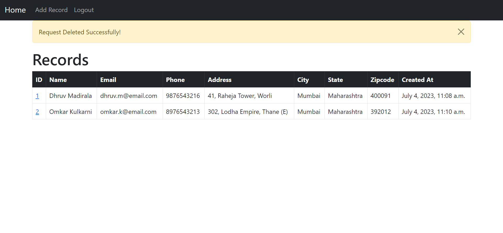
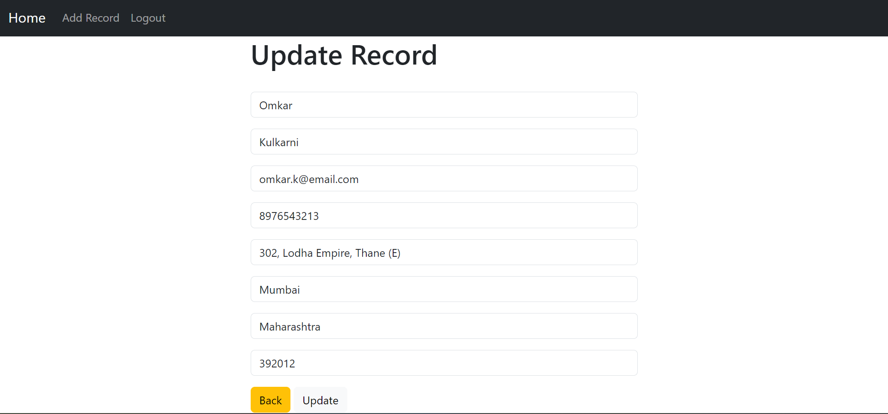
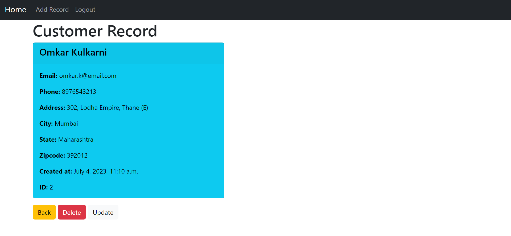
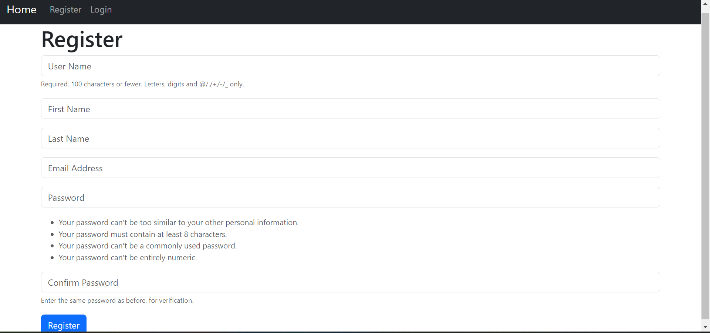
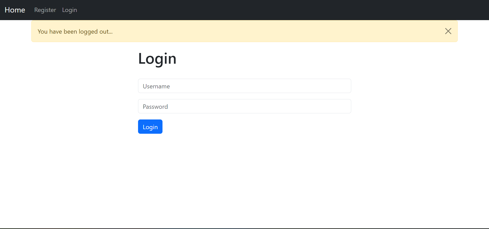
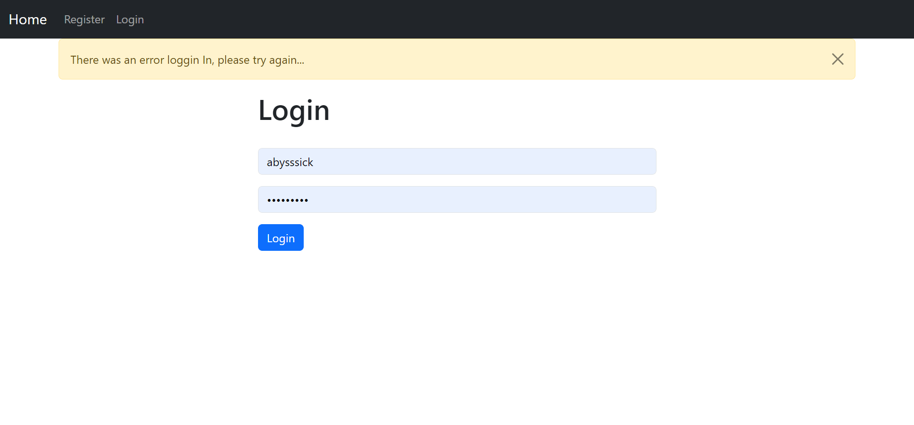

# CRM - Customer Relationship Management App

Welcome to CRM! CRM is a robust Customer Relationship Management application built with Django Rest Framework and Python. Streamline your customer interactions, manage leads, and enhance your business relationships effortlessly.

## Table of Contents

- [Features](#features)
- [Technologies Used](#technologies-used)
- [Screenshots](#screenshots)
- [Getting Started](#getting-started)
  - [Installation](#installation)
  - [Usage](#usage)

## Features

- **Customer Management**: Efficiently manage customer information and interactions.
- **Lead Tracking**: Keep track of leads and potential customers.
- **Task Management**: Organize and assign tasks for better team collaboration.
- **API Integration**: Easy integration with other applications through Django Rest Framework.
- **Secure Authentication**: User authentication and authorization for data protection.

## Technologies Used

- **Backend**:
  - Django Rest Framework
  - Python

## Screenshots


_Sign-in Page_


_Home Page_


_Add Record Page_


_Record Delete Action_


_Update Record Page_


_Individual Record Page_


_Register Page_


_If Logged out_


_If Incorrect Credentials_

## Getting Started

To get started with CRM, follow the instructions below.

### Installation

1. **Clone the Repository:**

   ```bash
   git clone https://github.com/your-username/crm-app.git
   ```

2. **Install Dependencies:**

   ```bash
   cd crm-app
   pip install -r requirements.txt
   ```

3. **Run Migrations:**

   ```bash
   python manage.py migrate
   ```

### Usage

1. **Run the Development Server:**

   ```bash
   python manage.py runserver
   ```

2. **Access the App:**

   Open your browser and navigate to `http://localhost:8000`.
